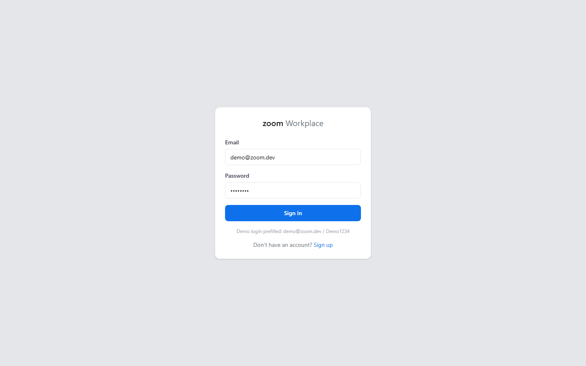
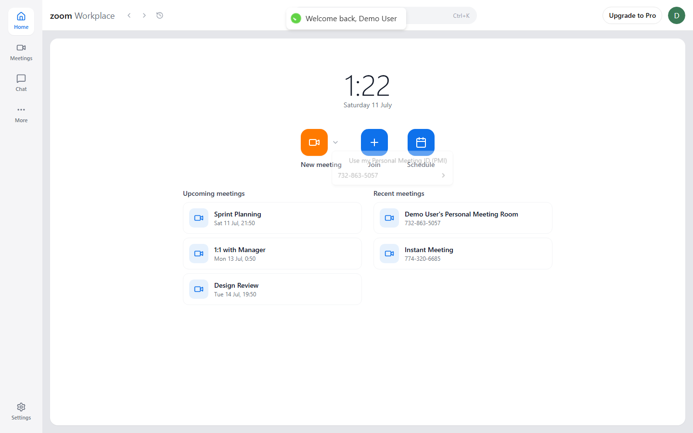
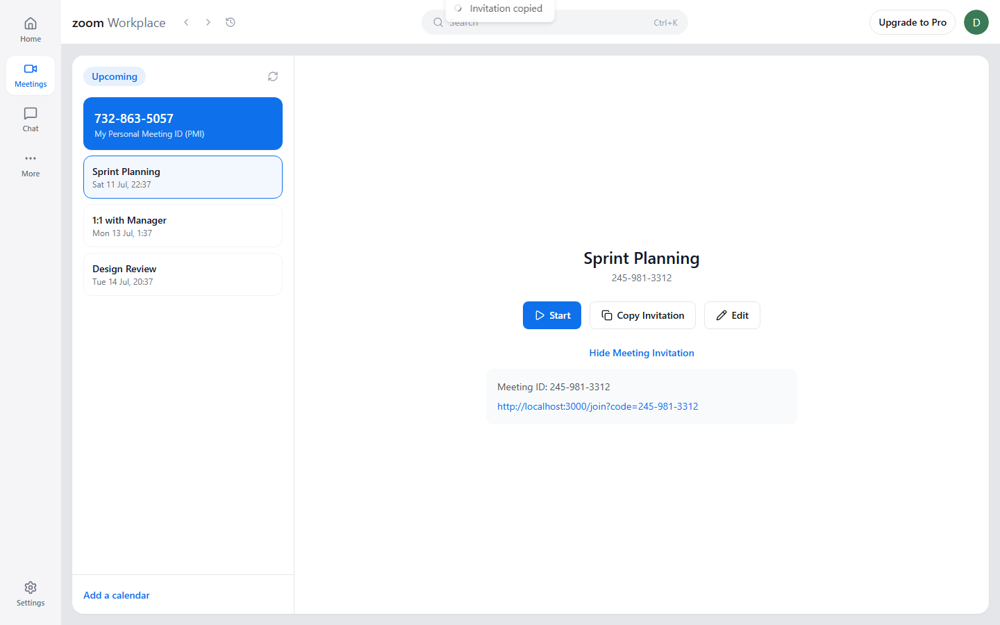
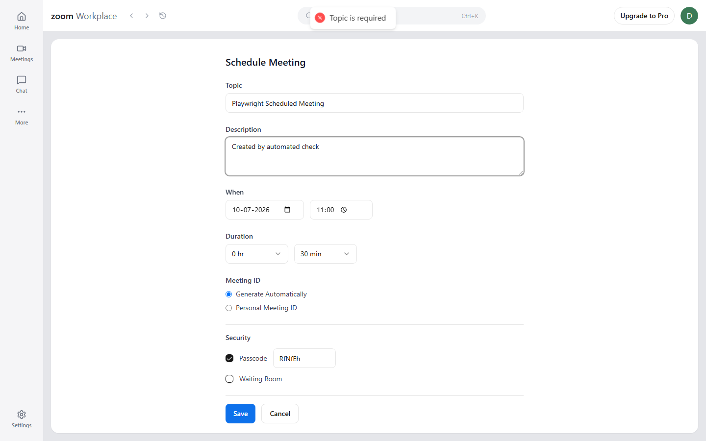
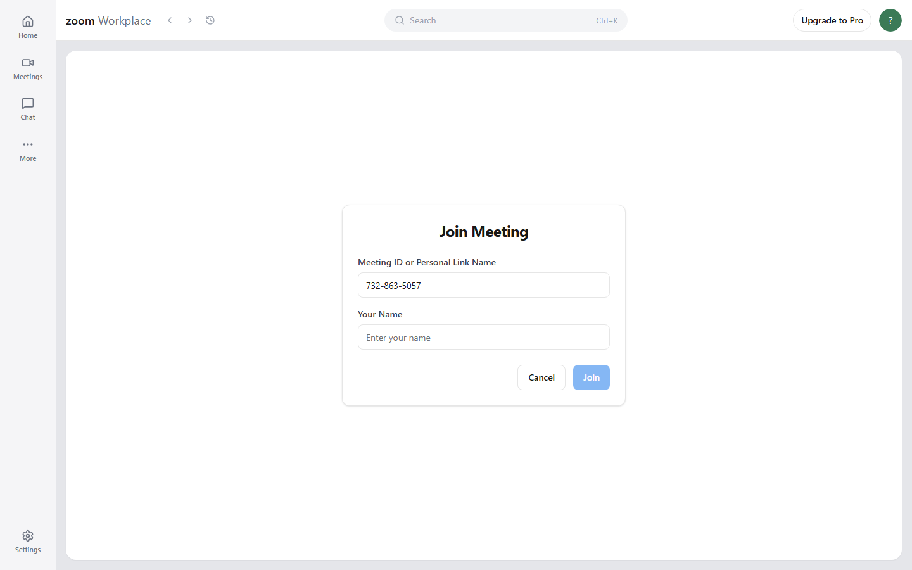
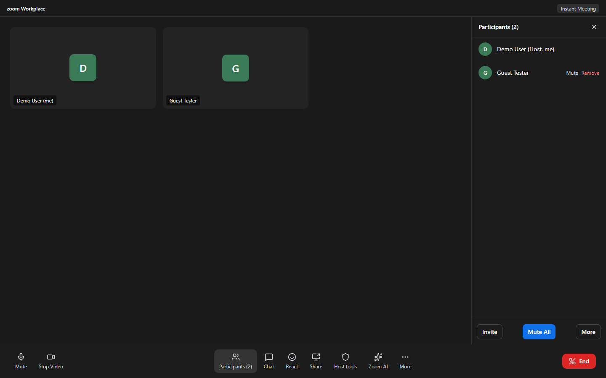

# Zoom Clone

A full-stack clone of the **Zoom Workplace** web app — dashboard, instant meetings, scheduling, joining, a two-pane meetings manager, and an in-meeting room with host controls (mute / mute-all / remove).

This is a **management-and-workflow clone, not a real-time media product.** There is no WebRTC or live audio/video — the meeting room is a faithful UI recreation (participant tiles, control bar, host controls) backed by real meeting and participant data in the database.

## Screenshots

| Login | Dashboard |
|---|---|
|  |  |

| Meetings | Schedule |
|---|---|
|  |  |

| Join | Meeting Room |
|---|---|
|  |  |

## Features

- **Auth** — signup/login with JWT, a seeded demo account for instant access.
- **Dashboard** — live clock, New meeting / Join / Schedule tiles, Upcoming & Recent sections.
- **Instant meetings** — one click generates a unique meeting code + invite link and drops you into the room as host.
- **Join** — by raw code, dashless code, or a full invite link; required display name for guests.
- **Schedule** — full form (topic, description, date/time, duration, passcode, waiting room); appears under Upcoming.
- **Meetings tab** — two-pane manager: PMI card pinned blue, upcoming list, detail pane with Start / Copy Invitation / Edit.
- **In-meeting room** — pre-join modal, dark stage with participant tiles, bottom control bar, right-side Participants drawer.
- **Host controls** — Mute one, Mute All, Remove participant, End meeting — all backed by the API.

## Tech stack

| Layer | Choice |
|---|---|
| Backend | FastAPI, SQLAlchemy 2.x, Pydantic v2, SQLite, python-jose (JWT), passlib+bcrypt |
| Frontend | Next.js 14 (App Router, TypeScript), Tailwind CSS, shadcn/ui (Radix primitives), axios, react-hot-toast, lucide-react, zustand |

The frontend is a standalone SPA that talks to the backend over HTTP — there's no Next.js API route layer.

## Repository structure

```
/server   → FastAPI backend
  app/
    main.py            app factory, CORS, routers, startup seed
    config.py           pydantic-settings Settings
    db/database.py      engine, session, connect_db()
    models/              User, Meeting, Participant (SQLAlchemy)
    validators/           Pydantic request/response schemas
    controllers/           business logic
    routes/                 thin APIRouters
    middlewares/             JWT auth dependency, global error handler
    utils/                    ApiResponse envelope, ApiError, security, enums
    seed.py                    idempotent demo data
/client   → Next.js 14 frontend
  src/
    app/                 routes (dashboard, auth, join, schedule, meetings, meeting room)
    components/           layout (shell) + meeting-specific components + shadcn/ui primitives
    lib/                    axios instance, shared types, cn() helper
    store/                   zustand auth store
    hooks/                    useRequireAuth route guard
/docs     → PRD, API spec, DB schema, UI spec, build plan, screenshots
```

## Getting started

### Prerequisites
- Python 3.11+
- Node.js 18+

### Backend

```bash
cd server
python -m venv .venv
# Windows:
.venv\Scripts\python.exe -m pip install -r requirements.txt
# macOS/Linux:
source .venv/bin/activate && pip install -r requirements.txt

cp .env.example .env   # adjust values if needed

# Windows:
.venv\Scripts\python.exe -m uvicorn app.main:app --reload --port 8000
# macOS/Linux:
uvicorn app.main:app --reload --port 8000
```

The API runs at `http://localhost:8000`, base path `/api/v1`. The SQLite database is created and seeded automatically on startup (idempotent — safe to restart).

### Frontend

```bash
cd client
npm install
cp .env.example .env.local   # adjust NEXT_PUBLIC_API_URL if needed
npm run dev
```

Runs at `http://localhost:3000`. Visit `/login` — the seeded demo credentials are prefilled.

**Demo login:** `demo@zoom.dev` / `Demo1234`

## Environment variables

**`server/.env`**

| Variable | Default | Notes |
|---|---|---|
| `PORT` | `8000` | |
| `CORS_ORIGIN` | `http://localhost:3000` | Comma-separated list for multiple allowed origins |
| `DATABASE_URL` | `sqlite:///./zoom_clone.db` | |
| `ACCESS_TOKEN_SECRET` | — | **Set a real random secret in production** |
| `ACCESS_TOKEN_EXPIRE_MINUTES` | `1440` | |
| `FRONTEND_URL` | `http://localhost:3000` | Used to build invite links |
| `DEFAULT_USER_*` | Demo User / demo / demo@zoom.dev / Demo1234 | Seeded account |

**`client/.env.local`**

| Variable | Default |
|---|---|
| `NEXT_PUBLIC_API_URL` | `http://localhost:8000/api/v1` |

## Database schema

Three tables — see [`docs/DATABASE.md`](docs/DATABASE.md) for full column/constraint detail.

```
users (1) ────< (many) meetings          a user hosts many meetings
meetings (1) ──< (many) participants     a meeting has many participants
users (1) ────< (many) participants      a user may appear as a participant (nullable — guests)
```

- **users** — id, full_name, username (unique), email (unique), password (bcrypt hash), created_at.
- **meetings** — id, meeting_code (unique), title, description, host_id → users, status (`instant`/`scheduled`), scheduled_at, duration_min, passcode, waiting_room, is_active, created_at.
- **participants** — id, meeting_id → meetings, user_id → users (nullable for guests), display_name, role (`host`/`participant`), is_muted, is_removed, joined_at, left_at.

Every response uses a consistent envelope: `{ statusCode, data, message, success }` (and `errors: []` on failure), enforced by a global error handler.

## API overview

Full contract in [`docs/API_SPEC.md`](docs/API_SPEC.md). Base path `/api/v1`.

| Method | Path | Auth |
|---|---|---|
| POST | `/auth/register`, `/auth/login` | — |
| GET | `/auth/me` | JWT |
| POST | `/meetings/instant`, `/meetings/schedule` | JWT |
| GET | `/meetings` (dashboard listing) | JWT |
| GET | `/meetings/{code}` | — |
| PATCH | `/meetings/{code}` | JWT, host |
| POST | `/meetings/{code}/end` | JWT, host |
| POST | `/meetings/{code}/join` | optional JWT |
| GET | `/meetings/{code}/participants` | — |
| POST | `/meetings/{code}/participants/{id}/mute`, `/mute-all`, `/{id}/remove` | JWT, host |

## Deployment

### Backend → Render

A `render.yaml` blueprint is included at the repo root:

1. On [Render](https://render.com), **New → Blueprint**, point it at this repo.
2. It provisions a Python web service rooted at `server/`, running `uvicorn app.main:app --host 0.0.0.0 --port $PORT`.
3. Set `CORS_ORIGIN` and `FRONTEND_URL` to your Vercel URL once you have it (these are marked `sync: false` so Render will prompt for them).
4. `ACCESS_TOKEN_SECRET` is auto-generated by the blueprint.

**Note on persistence:** Render's free tier has an ephemeral filesystem — the SQLite file resets on every deploy/restart. That's fine here since the app reseeds itself automatically on startup (idempotent), so the demo is always in a working state; it just won't retain data you create between restarts. For real persistence, add a paid Render disk and point `DATABASE_URL` at a path under its mount (e.g. `sqlite:////var/data/zoom_clone.db`).

**Note on cold starts:** Render's free tier spins the backend down after ~15 minutes of inactivity. The first request after that can take up to ~60 seconds to respond while it wakes back up — the frontend itself loads instantly (Vercel doesn't sleep), but login/dashboard data will hang until the backend is awake. If you're evaluating this after a period of inactivity, please allow up to a minute on the first action.

### Frontend → Vercel

1. Import this repo into [Vercel](https://vercel.com).
2. Set **Root Directory** to `client` (this is a monorepo — Vercel needs to know where the Next.js app lives).
3. Set the environment variable `NEXT_PUBLIC_API_URL` to your Render URL + `/api/v1` (e.g. `https://zoom-clone-api.onrender.com/api/v1`).
4. Deploy. Then go back to Render and set `CORS_ORIGIN`/`FRONTEND_URL` to the resulting `*.vercel.app` URL.

## Assumptions

- Real-time media is out of scope; the room is a UI recreation backed by real meeting data.
- A seeded default user satisfies "assume a default user is logged in," while full auth is also provided.
- Guests join by display name without an account (a participant row with a null `user_id`).
- Invite links point at the frontend's `/join?code=...`; no email is sent.
- "Chat", "React", "Share", "Zoom AI", "Host tools", "More", "Invite" are visual placeholders (toast on click) — explicitly out of scope per the PRD.
- There's no participant-initiated "leave" endpoint in the API contract (only host-issued remove sets `left_at`), so the room's Leave button is a frontend-only navigation rather than a fabricated backend call.
- Scheduled meetings always get a freshly generated code; the "Personal Meeting ID" option on the Schedule form is cosmetic for visual fidelity with Zoom's UI.
